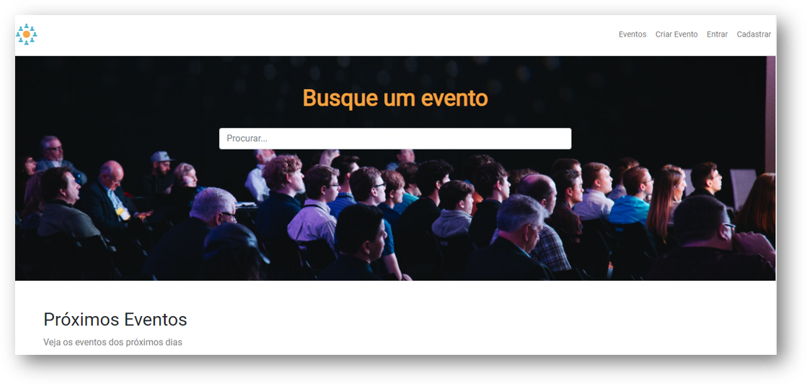
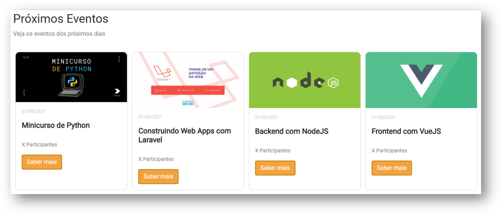
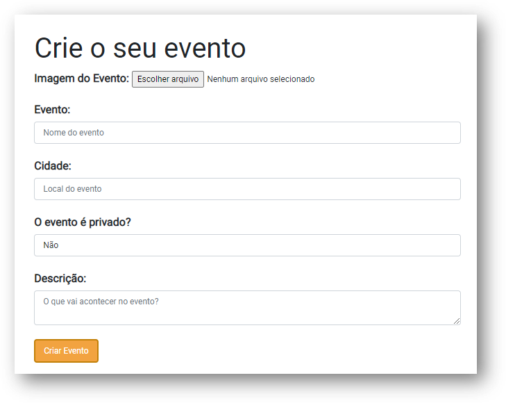
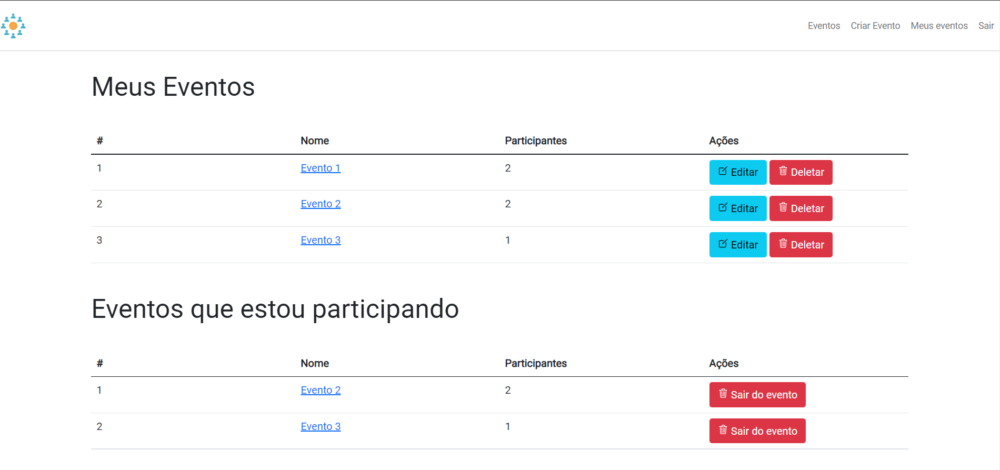

# Curso de Laravel - Hora de Codar

Referências:
* [Curso de Laravel - Youtube Playlist](https://www.youtube.com/playlist?list=PLnDvRpP8BnewYKI1n2chQrrR4EYiJKbUG)
* [Github Repo](https://github.com/matheusbattisti/curso_laravel)

